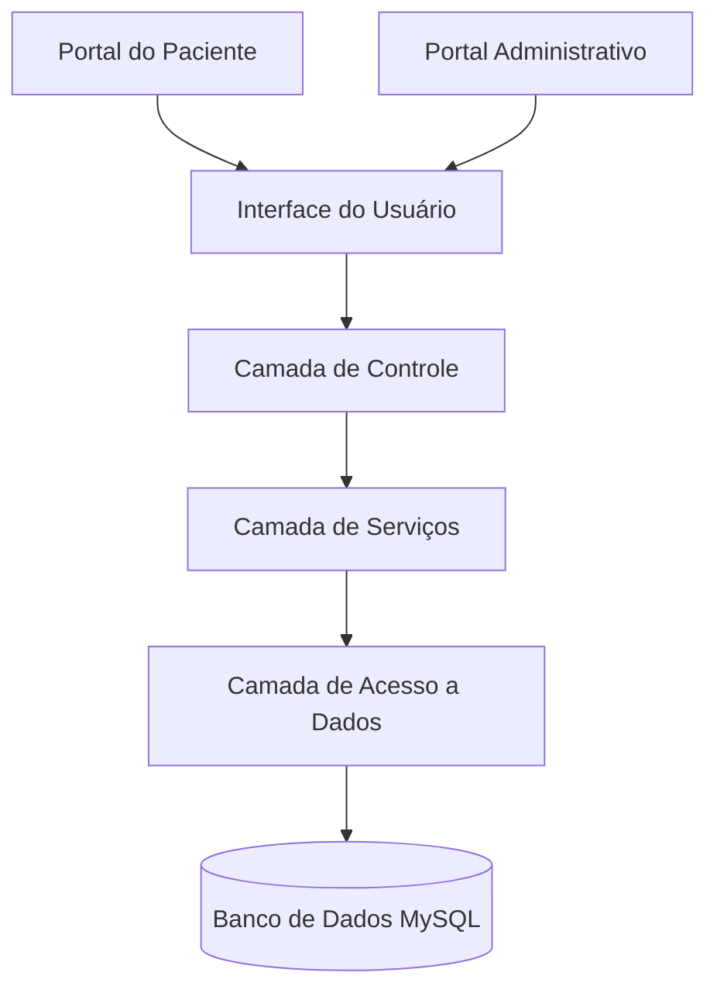

<div align="center">

# 🏥 Sistema de Gestão Hospitalar Pediátrico


[](https://github.com/seu-usuario/sistema-hospitalar-pediatrico)
[](https://github.com/seu-usuario/sistema-hospitalar-pediatrico/releases)
[](LICENSE)

</div>

<p align="center">
  <i>Um sistema completo para gestão hospitalar focado no atendimento pediátrico, tornando a experiência da criança mais segura e acolhedora.</i>
</p>

---

## 📋 Visão Geral

O **Sistema de Gestão Hospitalar Pediátrico** foi cuidadosamente projetado para otimizar o fluxo de trabalho em ambientes hospitalares focados no atendimento infantil. Nosso objetivo é proporcionar uma plataforma que não apenas gerencie informações médicas com precisão, mas também contribua para uma experiência mais humana e acolhedora para os pequenos pacientes e suas famílias.

<div align="center">
  
  
</div>

## 🌟 Recursos Principais

<table>
  <tr>
    <td width="50%" valign="top">
      <h3>🗓️ Gestão de Agendamentos</h3>
      <ul>
        <li><b>Consultas Inteligentes</b> - Sistema de agendamento que evita conflitos de horário</li>
        <li><b>Exames Programados</b> - Integração com laboratórios para resultados mais rápidos</li>
        <li><b>Procedimentos Médicos</b> - Preparação antecipada de salas e equipamentos</li>
        <li><b>Lembretes Automatizados</b> - Notificações para pacientes e responsáveis</li>
      </ul>
    </td>
    <td width="50%" valign="top">
      <h3>👨‍👩‍👧‍👦 Portal do Paciente</h3>
      <ul>
        <li><b>Cadastro Simplificado</b> - Processo de registro otimizado para famílias</li>
        <li><b>Histórico Completo</b> - Visualização de consultas anteriores e tratamentos</li>
        <li><b>Documentos Digitais</b> - Armazenamento seguro de exames e receitas</li>
        <li><b>Comunicação Direta</b> - Canal para dúvidas e orientações</li>
      </ul>
    </td>
  </tr>
  <tr>
    <td width="50%" valign="top">
      <h3>👩‍⚕️ Área Médica</h3>
      <ul>
        <li><b>Prontuário Digital</b> - Acesso rápido ao histórico médico completo</li>
        <li><b>Prescrição Eletrônica</b> - Eliminação de erros por ilegibilidade</li>
        <li><b>Histórico de Crescimento</b> - Gráficos evolutivos de desenvolvimento</li>
        <li><b>Alertas de Alergias</b> - Sistema de segurança para medicações</li>
      </ul>
    </td>
    <td width="50%" valign="top">
      <h3>👑 Portal Administrativo</h3>
      <ul>
        <li><b>Dashboard Analítico</b> - Métricas de desempenho em tempo real</li>
        <li><b>Gestão de Equipes</b> - Controle de escalas e especialidades</li>
        <li><b>Relatórios Customizados</b> - Exportação de dados para análise</li>
        <li><b>Controle Financeiro</b> - Integração com sistemas de faturamento</li>
      </ul>
    </td>
  </tr>
</table>

## 🚀 Demonstração

<div align="center">
  
  <br>
  <i>O dashboard intuitivo proporciona uma visão geral instantânea de todas as atividades hospitalares</i>
</div>

## 🛠️ Tecnologias

<div align="center">
  
  
  
  
  
  
</div>

## 📊 Arquitetura do Sistema



## ⚙️ Instalação e Configuração

<details>
<summary><b>🔍 Clique para expandir as instruções detalhadas</b></summary>

### Pré-requisitos
- XAMPP 8.1 ou superior
- PHP 8.1 ou superior
- MySQL 8.0 ou superior
- Navegador web atualizado

### Passo a Passo

1. **Clone o repositório**
   ```bash
   git clone https://github.com/seu-usuario/sistema-hospitalar-pediatrico.git
   cd sistema-hospitalar-pediatrico
   ```

2. **Configure o ambiente XAMPP**
   - Inicie o painel de controle do XAMPP
   - Ative os módulos Apache e MySQL
   - Verifique se as portas estão configuradas corretamente (80 e 3306 por padrão)

3. **Prepare o banco de dados**
   - Acesse: http://localhost/phpmyadmin
   - Crie um novo banco de dados: `hospital_pediatrico`
   - Selecione a codificação: `utf8mb4_unicode_ci`
   - Importe o arquivo de esquema: `database/schema.sql`
   - Importe os dados iniciais: `database/seed.sql`

4. **Configure as credenciais de acesso**
   ```php
   // Edite o arquivo config/db.php
   <?php
   $host = 'localhost';
   $user = 'root';  // Ou seu usuário personalizado
   $password = '';  // Sua senha se definida
   $database = 'hospital_pediatrico';
   $port = 3306;    // Porta padrão MySQL
   ?>
   ```

5. **Configure o projeto no servidor web**
   - Mova todos os arquivos para: `C:/xampp/htdocs/sistema-hospitalar-pediatrico`
   - Ajuste as permissões de arquivos se estiver em ambiente Linux:
     ```bash
     chmod -R 755 .
     chmod -R 777 uploads/
     ```

6. **Acesse o sistema**
   - Abra seu navegador e acesse: http://localhost/sistema-hospitalar-pediatrico
   - Faça login com as credenciais padrão:
     - Administrador: carlaplr@hospital.com / senha: root123
     - Paciente demonstração: familia@exemplo.com / senha: familia123

7. **Personalize as configurações**
   - Acesse o painel administrativo
   - Atualize as informações do hospital
   - Configure os horários de funcionamento

</details>

## 👥 Equipe de Desenvolvimento

<div align="center">

<table>
  <tr>
    <td align="center">
      <br />
      <b>Gustavo Moreno Souza</b><br/>
      <sub>Desenvolvedor Full Stack</sub><br/>
      <a href="https://www.linkedin.com/in/gustavo-moreno-8a925b26a/">
        
      </a>
    </td>
    <td align="center">
      <br />
      <b>Giovanna Joaquim</b><br/>
      <sub>UX/UI Designer</sub><br/>
      <a href="https://www.linkedin.com/in/giovanna-j-29651921a/">
        
      </a>
    </td>
    <td align="center">
      <br />
      <b>Carla Araujo</b><br/>
      <sub>Database Developer</sub><br/>
      <a href="https://www.linkedin.com/in/carla-araujo-b50956265/">
        
      </a>
    </td>
  </tr>
</table>

</div>

## 📈 Roadmap

- [x] Versão 1.0 - Sistema Base
- [ ] Versão 1.1 - Integração com Laboratórios
- [ ] Versão 1.2 - Aplicativo Mobile para Pacientes
- [ ] Versão 1.3 - Telemedicina para Consultas Remotas
- [ ] Versão 2.0 - Inteligência Artificial para Análise de Padrões

## 🤝 Contribuindo

<details>
<summary><b>Como contribuir com o projeto</b></summary>

1. 🍴 Faça um fork do projeto
2. 🌿 Crie sua branch de feature (`git checkout -b feature/recurso-incrivel`)
3. 📝 Faça suas alterações e commit (`git commit -m '✨ Adiciona novo recurso incrível'`)
4. 📤 Faça push para a branch (`git push origin feature/recurso-incrivel`)
5. 🔁 Abra um Pull Request

Consulte nosso [guia de contribuição](CONTRIBUTING.md) para detalhes completos sobre nosso código de conduta e processo para enviar pull requests.
</details>

## 📬 Contato

<div align="center">
  
[](mailto:g.moreno.souza05@gmail.com)
[](https://sistemahosp.com.br)
[](https://www.linkedin.com/in/gustavo-moreno-8a925b26a/)

</div>

## 📊 Estatísticas do Projeto

<div align="center">


</div>

---
